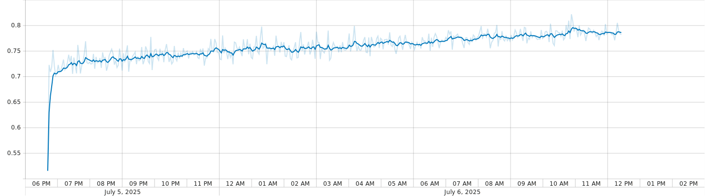
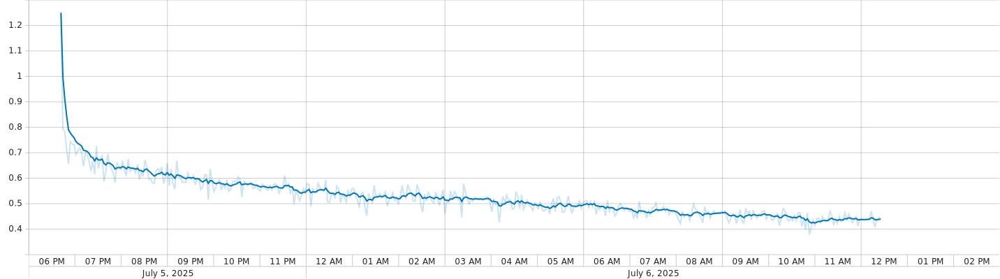

## No gráfico abaixo mostra a evolução da métrica Dice Coefficient ao longo das épocas de treinamento de um modelo de segmentação.

Eixo X: número de épocas (epoch), indicando o progresso do treinamento.

Eixo Y: valor da métrica Dice, que varia entre 0 e 1 (quanto mais próximo de 1, melhor a segmentação).

## No seguinte gráfico é representado a função de perda (loss function) ao longo das épocas durante o treinamento do modelo.

Eixo X: número de épocas (epoch).

Eixo Y: valor da perda, que normalmente parte de um valor alto e decresce com o tempo.
